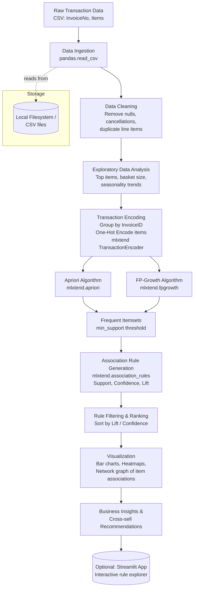

# Market Basket Analysis

## 1. Project Description

This project identifies which products are frequently purchased together by analyzing historical transaction data. The goal is to uncover product associations that a business can use to drive cross-selling, bundle offers, store layout decisions, and personalized recommendations.

**Problem type:** Unsupervised — Association Rule Mining (not classification/regression)

**Approach:**
1. Collect and clean transaction-level data (each row/group = items bought together in one transaction)
2. Perform Exploratory Data Analysis (EDA) to understand purchase behavior (most sold items, basket size distribution, seasonal patterns)
3. Transform data into a one-hot encoded "basket format" (transactions × items matrix)
4. Apply **Apriori** and **FP-Growth** algorithms to find frequent itemsets
5. Generate association rules from frequent itemsets using metrics like Support, Confidence, and Lift
6. Visualize frequent itemsets and top rules (bar charts, network graphs, heatmaps)
7. Translate top rules into actionable business recommendations (e.g. "customers who buy bread and butter also buy milk 68% of the time — bundle them")

**Dataset used:** Online Retail dataset (UCI/Kaggle) or Groceries dataset — transaction records containing InvoiceID/TransactionID and the items purchased in each transaction.

---

## 2. Algorithms, Tools & Resources

### Algorithms
| Algorithm | Purpose |
|---|---|
| **Apriori** | Classic frequent itemset mining using candidate generation + pruning (level-wise search) |
| **FP-Growth** | Faster alternative to Apriori — builds an FP-tree to mine frequent itemsets without candidate generation |
| **Association Rule Mining** | Generates "if-then" rules (e.g. {bread, butter} → {milk}) from frequent itemsets |

### Key Metrics Used
- **Support** – how frequently an itemset appears in all transactions
- **Confidence** – likelihood that item B is purchased when item A is purchased
- **Lift** – how much more likely B is purchased with A compared to B being purchased independently (Lift > 1 = meaningful association)
- **Conviction** (optional) – measure of implication strength between antecedent and consequent

### Tech Stack / Libraries
| Category | Tool |
|---|---|
| Language | Python 3 |
| Data handling | pandas, numpy |
| Association rule mining | mlxtend (`apriori`, `fpgrowth`, `association_rules`) |
| Visualization | matplotlib, seaborn, networkx (for rule network graphs), plotly (optional) |
| Notebook environment | Jupyter Notebook / Google Colab |
| Optional deployment | Streamlit (interactive rule explorer / product recommender demo) |

### Resources
- Dataset: [Online Retail Dataset – UCI/Kaggle](https://www.kaggle.com/datasets/carrie1/ecommerce-data) or [Groceries dataset – Kaggle](https://www.kaggle.com/datasets/irfanasrullah/groceries)
- mlxtend documentation (`frequent_patterns` module)
- Research reference: Agrawal & Srikant's original Apriori paper (conceptual background)

---

## 3. Project Pipeline (Architecture)



**Notes on architecture:**
- No database is used — transaction data is read directly from flat CSV files.
- No orchestrator (Airflow/Prefect) is needed since this is a one-time analytical run, not a recurring pipeline. If this were productionized (e.g. daily rule refresh for a live e-commerce site), it could be scheduled via Airflow with rules stored in a database instead of CSV.
- Both **Apriori** and **FP-Growth** are run so their frequent itemsets/performance can be compared — FP-Growth is generally faster on larger datasets since it avoids expensive candidate generation.
- Entire pipeline is implemented in **Python**, inside a Jupyter Notebook, with an optional Streamlit layer to interactively explore rules.

---

## 4. Project Structure (suggested)

```
market-basket-analysis/
│
├── data/
│   └── online_retail.csv
├── notebooks/
│   └── market_basket_analysis.ipynb
├── src/
│   ├── preprocessing.py
│   ├── mining.py          # apriori / fpgrowth logic
│   └── visualize.py
├── outputs/
│   └── association_rules.csv
├── app/
│   └── streamlit_app.py   (optional)
├── README.md
└── TRACKER.md
```

## 5. How to Run
```bash
pip install pandas numpy mlxtend matplotlib seaborn networkx

jupyter notebook notebooks/market_basket_analysis.ipynb
```
